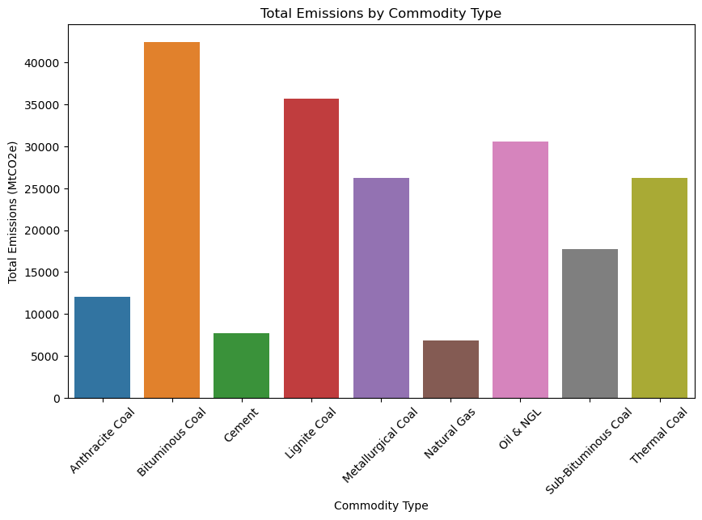

This project aims to analyze the historical emissions data from the Carbon Majors Emissions Dataset, focusing on trends and contributions from major oil, gas, coal, and cement producers since 1854. Through Exploratory Data Analysis (EDA), key insights were uncovered, such as the spike in emissions post-1950 and the varying contributions of investor-owned, state-owned, and national entities. The dataset was normalized for better comparability.

## Dataset

The dataset used in this project is publicly available on Kaggle.

You can find the dataset [here](https://www.kaggle.com/datasets/joebeachcapital/carbon-majors-emissions-data).

## Key Features

#### 1. **Trends and Relationships**

- **Trends Over Years**: Analyzed emission patterns over time to identify long-term trends and major shifts in emissions.
- **Production Value vs. Total Emissions**: Investigated the relationship between commodity production and associated emissions.
- **Commodity Wise Analysis**: Examined emissions and production trends across different commodities (oil, gas, coal, cement).

#### 2. **Entity and Emission Breakdown**

- **Parent Entity Distribution**: Analyzed the distribution of emissions and production across various entity types (investor-owned, state-owned, nation state).
- **Top Emitters by Parent Entity**: Identified the top emitting entities based on their production and emissions.
- **Emission Types in Subplots**: Analyzed different emission types (e.g., flaring, venting) to understand their contributions to total emissions.

#### 3. **Correlation and Distribution Analysis**

- **Correlation Matrix**: Analyzed correlations between features such as production, emissions, and entity type to uncover key patterns.
- **Commodity Distribution**: Investigated the distribution of emissions across commodities to highlight their individual contributions.

## EDA Insights

1. #### Total Emissions

   
   The line plot shows a clear upward trend in total emissions (MtCO2e) from the early 1900s to 2020.

2. #### Commodity Distribution

   

3. #### Correlation Matrix
   

- `product_emissions_MtCO2` has a very high correlation (0.96) with both `fugitive_methane_emissions_MtCO2e` and `total_operational_emissions_MtCO2e`.
- `own_fuel_use_emissions_MtCO2` and `venting_emissions_MtCO2` are also highly correlated (0.83).
- `total_emissions_MtCO2e` is highly correlated with `total_operational_emissions_MtCO2e` (0.97), indicating these variables are closely related.

4. #### Total Emissions by Commodity Type
   
